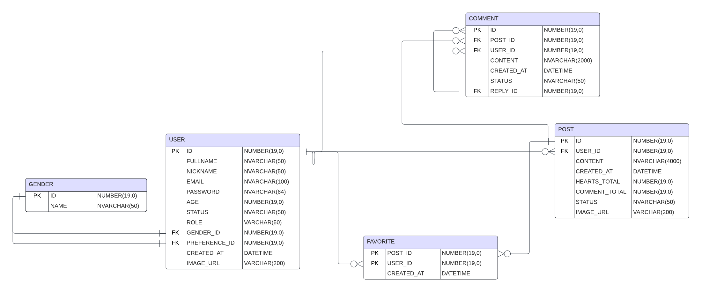

# PRJ Project

This is an open source social media platform based on Java Servlet.

## Team name
**LIT**

## Team members
- Vũ Kim Duy - SE182407
- Lê Quang Khánh - SE182420
- Võ Nguyên Minh Nhật - SE182355
- Nguyễn Trung Hưng - SE182394

# Requirements

## Overview
**LoveIt**
Social media platform to find lovers or friends. Only for 18 and up users.

## Features
### Account setup (For unregistered users)
 - Login
 - Register
 - Oauth Login (Using Google)
 - New users, setup personal info such as name, age, email, location, gender, preferred gender.

### Welcome page (for new users)
If user is already login, go to homepage.

First time users will setup personal relationship preference, 
then homepage will show users/posts with selected preference (unregistered user will not be able to love posts or comments).

### Homepage/Find Lover/Feed
- Users can scroll through posts of people looking for relationship.
- **Users** can make posts. **Original posters** can delete and modify their posts.
- Ability to filter posts/users by preference (gender, location).
- "Love" button to save post for later.
- **Comments**:
    - Click into post to see comments.
    - 1 layer nested comment, each comment will have one or more replies.
    - Reply is shown below the comment they are replying to.
- Posts in feed are shown based on personal preference (the more similar a poster is to the user, the more likely the user will see that person's post).
- Flag button to report violating posts to admins.

### Chat *(Optional)*
- Each user is able to direct message others.
- Message is updated in real time.

### Profile
- Show personal info (Name, age, gender, preference, avatar) of users.
- If the user is owner of profile, they will have ability to change gender or love preference (not email or name due to impersonations).

### Favorites (Loved posts)
- List of favourite post.

### Admin page
- Post manager: see user-reported posts, search content, hide posts, delete posts.
- User manager: see all user, search users, delete account, block users from logging in.
- Dashboard: see analytics charts of data, such as number of posts, accounts, messages, genders...

# Wireframe

# Database
Entity Relationship Diagram: https://lucid.app/lucidchart/344aa0da-d180-4587-92dd-d4e279696b2e/edit?viewport_loc=-2184%2C-1050%2C2920%2C1509%2C0_0&invitationId=inv_734072b5-348e-4cb1-bc4e-86edd0d151d4

# System Design
Class diagram: https://drive.google.com/file/d/1iKp6VHsZJ6P5FCMZUTvB610y7a24B-YV/view?usp=sharing 

